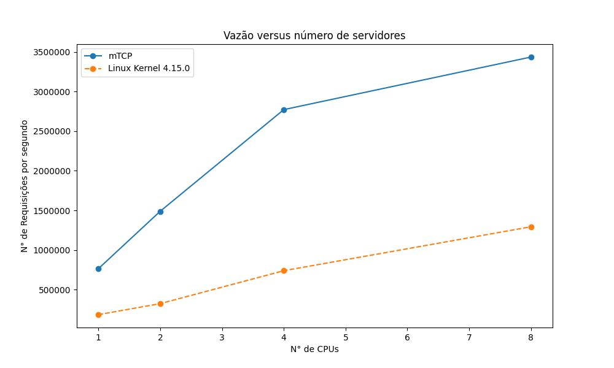

## Cenário 1

Neste cenário foi testado a escalabilidade da vazão de requisições ao se escalar um servidor na sua capacidade total.

Para atingir o comportamento desejado são criadas 8 threads cliente e uma de medição de latência. Cada uma das threads clientes cria 2000 conexões com nosso servidor e começa a enviar e receber requisições de volta.

| N° CPUs 	| 1      	| 2       	| 4       	| 8       	|
|---------	|--------	|---------	|---------	|---------	|
| mTCP    	| 765426 	| 1489366 	| 2771444 	| 3434648 	|
| Linux   	| 186268 	| 324960  	| 740203  	| 1294459 	|

